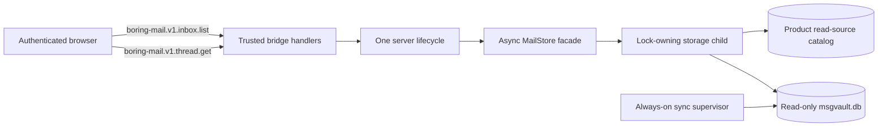
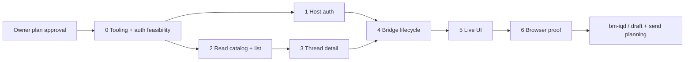

# gh-9 — Connect the real unified inbox to the browser

## Problem

Boring Mail has a production-safe msgvault v0.19.3 polling supervisor (`bm-h79`, PR #8) and a connected-account-only, globally coalesced unified inbox projection behind the async lock-owning `MailStore` (`bm-eii`, PR #7). The active browser uses neither. `boring-mail/src/boring-ui/front.tsx`, `MailSourcePane.tsx`, and `MailThreadPanel.tsx` import `mockData.ts` directly, so the owner still sees six fixture emails while the real archive synchronizes in the background.

No authenticated browser operation exposes `MailStore.listUnifiedInbox`. No public `MailStore` method returns an authorized conversation detail. The existing fixture thread panel executes `bodyHtml` with `dangerouslySetInnerHTML`, so it cannot safely receive provider content. The active surface resolver also refuses any target that is not in the fixture.

This issue delivers the first truthful, owner-testable read surface: live unified inbox → selected representative-source conversation. Draft mutation and sending are deliberately deferred so the live read boundary can be proven without writing live-derived PII into generic workspace files.

## Goals

1. Render the real connected Gmail unified inbox through the public async `MailStore` process boundary.
2. Open an opaque selected-message target into its source-coherent conversation; derive source/conversation server-side.
3. Render bounded plain-text bodies and bounded recipient/attachment metadata without live HTML, remote content, raw MIME, or storage paths.
4. Use trusted browser-only `boring-mail.v1.*` WorkspaceBridge operations with strict schemas, capabilities, byte limits, and typed expected failures.
5. Remove mock fallback and unsupported mailbox/tag/star/search controls from the active live browser path.
6. Make the current remote-browser/Tailscale playground safe for live mail by protecting the complete Vite surface and proxied host API, not only mail bridge calls.
7. Prove the exact synthetic and live click paths with Playwright; mask every live PII locator in screenshots and never log mail fields.
8. Preserve sync independence: browser/HTTP idle never pauses polling and no health HTTP route is added.

## Non-goals

- Compose, reply-draft persistence, `.mail.md` editing, Gmail sending, OAuth, approval, reconciliation, retry, or any state-changing mail operation.
- Gmail mutations such as mark-read/star/move.
- Search, local tags, triage, pinning, Inbox/All/Sent/Starred/Snoozed/Trash tabs.
- Sanitized rich HTML, remote images, attachment bytes/downloads/previews.
- Cross-source conversation merging. One selected representative opens one source-owned conversation.
- Migrating the agent tool’s fixture search. In live mode its fixture-only read commands must be labelled unavailable rather than falsely presented as live.
- Securing a future production deployment outside this standalone playground. The plan secures the exact Vite + loopback backend topology used for owner validation.

## Grounded current architecture

### Active fixture path

```text
App.tsx / WorkspaceAgentFront
  -> boring-ui/front.tsx
  -> MailSourcePane.tsx ----> mockData.ts
  -> MailThreadPanel.tsx ---> mockData.ts + dangerouslySetInnerHTML
```

The server plugin acquires the sync lease but does not open `MailStore`. Its only plugin route is a bare draft mutation. The app enables insecure local bridge auth while Vite binds externally and proxies `/api/v1` to the loopback backend.

### Existing real read path

```text
MailStore.listUnifiedInbox()
  -> child-process RPC
  -> ProductStore.connectedInboxSources()
  -> read-only msgvault unified projection
  -> generation/data-version/source-digest-bound page
```

The current storage DTO contains authority/internal fields (`conversationId`, `sourceId`, `sourceIdentifier`, `rfc822MessageId`) and lacks sender display/email. It must not be serialized directly to the browser.

### Pinned Workspace host facts (`@hachej/boring-workspace@0.1.103`)

- Trusted prebuilt server plugins may contribute `workspaceBridgeHandlers`.
- Browser transport is `POST /api/v1/workspace-bridge/call` with `{op,input,requestId,idempotencyKey?}`.
- `defineTrustedDomainBridgeHandler` enforces caller class, capabilities, schemas, byte limits, timeout, and idempotency policy.
- The exported bearer-token `bridge-client` is unsuitable for browser auth; no suitable provider-aware browser client is exported. Plugin provider props supply `apiBaseUrl`, `authHeaders`, `authScopeKey`, `onAuthError`, `apiTimeout`, and active session.
- Bare plugin routes get no automatic auth/origin/CSRF wrapper.
- The standalone bridge owner is `default`; the front currently presents `boring-mail`, hidden by insecure owner forcing.
- Bridge timeout aborts the handler signal but does not cancel an in-flight MailStore RPC. The MailStore deadline is shorter and fail-stops the storage process, providing an independent wall-clock bound; detail queries additionally have physical candidate/fanout bounds.

## Solution



A standalone deployment guard authenticates the whole Vite origin before assets or any `/api/v1/**` proxy are reachable. The bridge separately enforces exact origin, CSRF proof, caller class, owner workspace, and mail-read capability. One server lifecycle owns both sync and store leases.

## Owner decisions ratified

Owner approved all six recommendations with the instruction **“merge”** on 2026-08-27. This approval covers the exact revision reviewed at the owner gate; changing any item requires renewed owner review.

| Decision | Recommendation | Why |
|---|---|---|
| Owner access transport | HTTP Basic password from a server-side `0600` token file over tailnet-only HTTP, explicitly accepting Tailscale/WireGuard as the encrypted transport boundary; exact allowed origin; one prompt/session | Protects assets, HMR, generic host APIs, and bridge in the actual topology without putting a token in app JS. If the origin becomes non-tailnet, HTTPS is mandatory |
| Message rendering | Plain text only | Avoids email HTML XSS/tracking; sanitized HTML is a separate security design |
| Read-account bootstrap | Separate product `mail_read_sources` catalog; new authenticated msgvault Gmail sources default `enabled=1`, missing sources become `present=0`, and a future user disable persists | Existing msgvault authentication is accepted as read connection while read state remains separate from send authorization |
| Conversation semantics | Representative source only | Matches unified projection ownership and avoids inventing cross-account thread merging |
| Browser target | Process-generation HMAC target minted only by successful list results | Prevents sequential msgvault ID enumeration; handler still rechecks current eligibility |
| Live visual artifact | Retain exactly two masked screenshots: loaded inbox list and clicked thread detail; static host title, whole provider containers masked, all automatic failure/report artifacts disabled | Satisfies exact-path screenshot proof without persisting live provider metadata |

These six decisions are owner-ratified. Only Slice 0 may become dispatch-ready; every later implementation Bead remains deferred behind its dependency and the committed Slice 0 GO verdict.

## Decisions and contracts

### P9-D1. Bridge-primary is already owner-ratified

Owner comment on `bm-gate-bridge-vs-routes-any` ratified `boring-mail.v1.*` bridge operations. This plan applies that decision to bounded PII reads. It adds no inbox/thread JSON route and no attachment route. The old draft route is not called or exposed by the live front; its migration remains a separate prerequisite for draft UI.

### P9-D2. Host-wide authentication for the standalone owner surface

Live mode requires:

1. Vite binds only the configured explicit host/IP and exact port.
2. A Vite `configureServer` middleware runs before assets, HMR, and proxies and requires HTTP Basic credentials for every request.
3. Username is fixed and non-sensitive; password bytes come from a verified token descriptor.
4. Token file contract: canonical parent; `lstat/open(O_RDONLY|O_NOFOLLOW)/fstat` identity match; regular file; one hard link; current effective UID; exact `0600`; at most 256 bytes; one trimmed base64url token decoding to at least 32 random bytes; no embedded whitespace/newlines.
5. Comparison performs length check then `timingSafeEqual` on decoded bytes.
6. Vite consumes and strips the client `Authorization` header plus every client-supplied proxy-principal/proof header before proxying; it injects an unguessable in-process backend proof only after Basic authentication. Fastify/plugin code never receives Basic credentials.
7. Backend remains loopback-only. `createBrowserBridgeAuthPolicy` trusts only the injected proof, exact configured origin, owner workspace `default`, non-empty CSRF header, and capability `boring-mail:inbox:read`.
8. Front changes `workspaceId` to `default`; project labels remain “Boring Mail.”
9. In tailnet-HTTP mode, live boot runs a bounded `tailscale status --json` probe, requires configured bind/origin IP to exactly match a current local `Self.TailscaleIPs` address, and requires explicit `BORING_MAIL_TRUST_TAILNET_HTTP=1`. Live boot otherwise requires HTTPS. It refuses wildcard/missing origin, insecure local bridge auth, missing/unsafe token file, default HMR host, or exposed backend binding.

Synthetic mode is explicit, uses only temporary fixture DBs with `.invalid` identities, disables sync, and binds both Vite/backend to loopback. It may use deterministic test credentials. No live failure falls back to fixture data.

The owner gate explicitly accepts tailnet-only plain HTTP because Tailscale/WireGuard provides transport encryption; Basic auth is forbidden on a non-tailnet or unencrypted routed origin, where HTTPS becomes mandatory. A pre-mail spike must prove unauthenticated clients cannot load `/`, establish HMR, call `/api/v1/**`, or reach the proxy; authenticated Playwright credentials can. If Vite middleware cannot reliably gate HMR/proxy traffic, implementation stops and escalates rather than enabling live mail.

### P9-D3. Two browser-only read operations

| Operation | Capability | Idempotency | Timeout | Input cap | Output cap |
|---|---|---|---:|---:|---:|
| `boring-mail.v1.inbox.list` | `boring-mail:inbox:read` | none | 10 s | 4 KiB | 512 KiB |
| `boring-mail.v1.thread.get` | `boring-mail:inbox:read` | none | 10 s | 1 KiB | 512 KiB |

Both allow only caller class `browser` and use direct `zod` schemas with `.strict()`, safe-integer/range/length refinements, discriminated output unions, and UTF-8 byte refinements. The pinned host’s plain-object schema validator does not enforce pattern/range/string/array constraints; implementation must pass schemas exposing `safeParse`. `zod` becomes a direct dependency, and TypeScript types are inferred from the schemas.

Contract ownership is split without overlap: Slice 2 creates `mail/bridge/mailBridgeListContract.ts`; Slice 3 creates `mail/bridge/mailBridgeThreadContract.ts`; Slice 4 imports both unchanged and owns transport/client wiring.

Schema failures remain host `BRIDGE_SCHEMA_INVALID`; they are not domain output. Expected output status vocabulary is closed and underscore-only:

```ts
type InboxReadStatus = 'ok' | 'stale_cursor' | 'unavailable'
type ThreadReadStatus = 'ok' | 'not_found' | 'unavailable'
```

Unknown errors are generic bridge failures. Logs include operation/request IDs and error codes only, never DTOs, inputs, account identifiers, subject/snippet/body, recipients, or attachment names.

### P9-D4. Exact browser inbox schema

```ts
interface BrowserInboxListInput {
  limit?: number        // integer 1..50, default 30
  cursor?: string       // 1..2048 bytes
}
interface BrowserInboxItem {
  target: string        // process-generation HMAC token, <=160 base64url/ASCII bytes
  senderName: string | null
  senderEmail: string | null
  subject: string
  snippet: string              // null storage value maps to empty string
  messageAt: string | null
  unread: boolean
  hasAttachments: boolean
  coalesced: boolean
  copyCount: number
  truncated: { senderName: boolean; senderEmail: boolean; subject: boolean; snippet: boolean }
}
type BrowserInboxListOutput =
  | { status: 'ok'; items: BrowserInboxItem[]; nextCursor: string | null }
  | { status: 'stale_cursor' | 'unavailable' }
```

The bridge mapper explicitly excludes `conversationId`, `sourceId`, `sourceIdentifier`, and `rfc822MessageId`.

Text normalization/limits before JSON encoding:

| Field | Max UTF-8 bytes | Rule |
|---|---:|---|
| sender name | 512 | NFC, strip C0 except tab/newline, truncate code-point safely |
| sender email | 320 | printable single line, otherwise null |
| subject | 1,024 | normalized controls, null/empty fallback `(no subject)` |
| snippet | 2,048 | null maps to empty string; normalized controls |
| timestamp | 64 | nullable validated text |

Slice 2 changes projection SQL to select bounded prefixes plus overflow sentinels for subject, snippet, sender name, and sender email; unbounded provider cells never cross worker RPC. Prefixes use at most the field’s max character count plus one, then shared UTF-8 truncation applies the byte cap. After per-field truncation, handler measures `JSON.stringify(output)` bytes and asserts it is below 480 KiB; the stated 50-row caps make this reachable without dropping/rebudgeting rows. It preserves every row and the original authoritative storage cursor. Normalization removes C0 controls except tab/newline, so escape expansion is bounded; the 512 KiB bridge cap remains a final tripwire. Hostile multi-megabyte/quote/control/astral-Unicode multi-page oracle tests prove bounded RPC bytes with no gaps or duplicates.

The existing adaptive exact projection, including its source-indexed fallback and exact copy count, is retained: no candidate cap may silently drop inbox messages or falsify `copyCount`. Its independent wall-clock bound is the <=9 s MailStore fail-stop deadline, after which the process is terminated and the browser receives `unavailable`; the existing adversarial list benchmark and query-plan gates remain mandatory.

### P9-D5. Separate read-source catalog, never send authorization

Add product migration:

```text
mail_read_sources(
  source_id INTEGER PRIMARY KEY,
  exact_identifier TEXT NOT NULL,
  identities_json TEXT NOT NULL,
  enabled INTEGER NOT NULL,
  present INTEGER NOT NULL,
  reconciled_ms INTEGER NOT NULL
)
```

This table alone feeds unified inbox eligibility when `enabled=1 AND present=1`. `mail_accounts` remains compose/send authorization and is not populated from msgvault read credentials. Existing connected `mail_accounts` are copied once with both bits set during migration for backward compatibility; future send-account writes do not mutate read state. A future account-management UI may change `enabled`; reconciliation never overwrites it.

`MailStore.reconcileMsgvaultReadSources()` is explicit and worker-owned:

1. validate exact v0.19.3 `sources` and `account_identities` schema;
2. select Gmail sources by exact `source_type='gmail'`;
3. include source identifier plus every confirmed `account_identities.address` for that source;
4. reject duplicate source IDs, empty/non-email identities, and conflicting normalized identity sets;
5. one product-DB transaction inserts new sources with `enabled=1,present=1`, updates current rows and `present=1` without changing `enabled`, and marks absent prior rows `present=0`;
6. preserve exact identifier for diagnostics internally, normalize authorization identities lowercase;
7. reject identity/source collisions rather than merging authority;
8. return only counts/generation, never identifiers.

Reconcile runs at server startup and before list/detail reads. The eligible-source digest includes only `enabled=1,present=1` source IDs and normalized identities, so catalog or user-enable changes invalidate cursors. Reconciliation never satisfies `mail_accounts`, compose, send-as, or approval checks.

### P9-D6. Exact pinned msgvault detail schema

Pinned upstream `v0.19.3` contract, captured from `internal/store/schema.sql`:

- `message_bodies(message_id INTEGER PRIMARY KEY REFERENCES messages(id), body_text TEXT, body_html TEXT)`; at most one optional body row per message.
- `account_identities(source_id INTEGER NOT NULL, address TEXT NOT NULL, source_signal TEXT NOT NULL DEFAULT '', confirmed_at DATETIME NOT NULL DEFAULT CURRENT_TIMESTAMP, PRIMARY KEY(source_id,address))`; every row is confirmed by table semantics.
- `idx_messages_conversation(conversation_id,sent_at DESC)`.
- `idx_message_recipients_message(message_id)`.
- `idx_attachments_message(message_id)`.
- `message_bodies` primary key provides message lookup.

Slice 2/3 extend the synthetic SQL fixture and strict adapter checks with these exact tables/columns/indexes. No live-mail rows are captured. The direct-runtime upgrade gate remains exact v0.19.3; any version upgrade re-verifies this contract.

### P9-D7. Authorized thread-detail contract

Bridge input and output:

```ts
interface BrowserThreadGetInput { target: string } // process-generation HMAC token, <=160 ASCII bytes
interface BrowserThreadMessage {
  sentAt: string | null
  sender: { name: string | null; email: string | null }
  recipients: Array<{ type: 'to' | 'cc' | 'bcc'; name: string | null; email: string }>
  bodyText: string
  bodyUnavailable: boolean
  bodyTruncated: boolean
  attachments: Array<{ filename: string | null; mimeType: string | null; byteSize: number | null }>
  metadataTruncated: boolean
}
interface BrowserThreadDetail {
  target: string
  subject: string       // selected message subject; null/empty -> `(no subject)`
  messages: BrowserThreadMessage[]
  historyTruncated: boolean
  selectedOutsideRecentWindow: boolean
  replyCapability: { allowed: false; reason: 'drafts_not_in_scope' }
}
type BrowserThreadGetOutput =
  | { status: 'ok'; thread: BrowserThreadDetail }
  | { status: 'not_found' | 'unavailable' }
```

Internal public method:

```ts
getUnifiedThread(input: { messageId: number }): Promise<UnifiedThreadDetail | null>
```

The worker derives and verifies everything:

1. reconcile read catalog;
2. the trusted Slice 4 bridge handler accepts exactly `bm1.<decimal>.<tag>`: canonical positive decimal with no leading zero, <=`Number.MAX_SAFE_INTEGER`; `tag` is unpadded base64url of the full 32-byte HMAC-SHA256 over UTF-8 `boring-mail.thread-target.v1\0<decimal>` using a process-random 32-byte key. It decodes via `BigInt`, verifies equal-length tag bytes with `timingSafeEqual`, and passes only the safe integer to worker; the key never enters RPC. Malformed, tampered, or prior-process targets map indistinguishably to `not_found`;
3. the worker independently validates a positive safe integer and requires the selected row to be a live `message_type='email'` message;
4. selected source must be `enabled=1,present=1` in `mail_read_sources`;
5. join conversation with matching source and `conversation_type='email_thread'`;
6. fetch the separately authorized selected row regardless of age. Use the implicit rowid tie order of `idx_messages_conversation` with `ORDER BY sent_at DESC,id ASC LIMIT 501`; query-plan tests must show no temporary B-tree. Inspect at most the first 500 candidates and record whether row 501 exists. Filter live same-source email rows. Define `recentWindow` as the newest 25 filtered live rows. If selected is in it, return that window; otherwise return the newest 24 plus selected. Then sort retained rows chronologically in memory. `selectedOutsideRecentWindow` is true exactly when selected was absent from `recentWindow`. `historyTruncated` is true when row 501 exists, more filtered live rows exist than were retained, selected is outside, or later output budgeting drops non-selected rows. The UI shows a gap/truncated-history marker rather than implying continuity;
7. SQL selects bounded text prefixes plus overflow sentinels for subject, sender fields, body text, recipient fields, filename, and MIME type, so multi-megabyte provider cells never cross RPC. Reserve up to 64 KiB of the 160 KiB body budget for the selected message, then allocate newest-first; final trimming may never drop the selected message;
8. fetch the optional body row by primary key; for recipients and attachments, run at most 25 local indexed per-message queries using `ORDER BY id ASC LIMIT 21` (no temporary B-tree), then sort retained recipient DTOs in memory by type/id;
9. apply deterministic global budgets.

Global detail budgets:

- 25 messages;
- 160 KiB normalized body text total, newest-first allocation, 64 KiB per message;
- 64 recipients total, 20 per message;
- 64 attachments total, 20 per message;
- sender/recipient name 512 bytes, email 320 bytes;
- subject 2 KiB, filename 1 KiB, MIME type 255 bytes;
- C0 controls removed except tab/newline before JSON, code-point-safe truncation;
- body HTML, raw MIME, hashes, paths, provider metadata never selected into the DTO.

Rows order deterministically by message time/id, recipient type/id, and attachment id. The selected message is always retained and visible even when older than 500 candidates. Canonical source mapping is fail-closed and explicit:

| Source condition | Mapping |
|---|---|
| null/empty/invalid sender | nullable sender fields |
| null/invalid recipient email | omit row and set `metadataTruncated` |
| unknown recipient type | omit row and set `metadataTruncated` |
| null attachment filename/MIME | preserve null |
| negative/unsafe/null attachment size | preserve null; invalid non-null type is corruption/unavailable |
| absent body row or null `body_text` | empty text + `bodyUnavailable=true` |
| malformed timestamp/text type | corruption/unavailable, never stringify coercion |
| selected subject null/empty | `(no subject)` before 2 KiB normalization/truncation |

A body primary key means at most one row, not that every message has one. After mapping, `JSON.stringify` must remain below 480 KiB. If hostile escaping/metadata still exceeds that budget, trim non-selected earliest body text, then excess non-selected earliest metadata, then oldest non-selected messages, setting truncation flags; the separately selected message and its reserved body slot are never dropped. Never emit partial UTF-8. The bridge 512 KiB cap is the final guard. Tests include target MAC tampering, another-process target, max-safe/max-safe-plus-one payloads, and every mapping row above.

Add `benchmark:thread-detail` with 25 selected messages, a conversation containing thousands of deleted/null/equal-time candidates, selected messages with extreme recipient/attachment fanout, thousands of irrelevant rows, and maximal bounded strings. Use an explicit warmed local regression threshold of 250 ms as a test-host tripwire, not a production SLA. Require query-plan assertions with no temporary B-tree for candidate/metadata queries and prove each metadata query returns no more than its `LIMIT+1` contract.

### P9-D8. One lifecycle, bounded timeouts

Server plugin creates a serialized lifecycle manager:

- secure deployment/auth verification;
- default Linux product path `${XDG_DATA_HOME:-$HOME/.local/share}/boring-mail/default/mail.db`, parent `0700`;
- exact msgvault path from the sync runtime resolver;
- one `MailStore` lease with 5 s startup timeout and 7.5 s read RPC timeout;
- one sync runtime lease;
- startup catalog reconcile;
- each list/detail operation performs reconcile + read inside one worker RPC, not two cumulative RPC deadlines;
- that RPC owns one `BEGIN DEFERRED` msgvault read transaction spanning source/identity discovery, product-catalog reconcile input capture, selected/list/detail/body/recipient/attachment queries, and snapshot version capture. Product reconciliation writes its separate product DB transaction while the msgvault WAL read snapshot remains open. Projection/detail helpers accept caller-owned transaction context and never nest transactions;
- after msgvault commit, compare `PRAGMA data_version` with the captured version: list maps a concurrent commit to `stale_cursor`; detail maps it to `unavailable` for a fresh retry, so no revoked/mixed generation is displayed;
- bridge handlers call `getStore()` through the manager rather than retaining a dead facade.

The 10 s bridge deadline reserves at least 2 s mapping/transport margin. If a read returns `rpc_timeout`/worker failure, the manager atomically marks that generation dead, starts disposal without awaiting its 5 s kill grace, and returns typed `unavailable` before the bridge deadline. One background recovery task awaits the existing disposal tombstone, opens/reconciles a replacement with its own 5 s startup deadline, and publishes it atomically. While recovery is pending, requests return `unavailable` immediately; Retry succeeds only after recovery. Elapsed-time tests cover hung read, immediate typed response, delayed disposal, concurrent retries, and reopened success. Startup acquisition unwinds in reverse order. Shutdown prevents reopen and uses all-settled cleanup so both store and sync release are attempted.

Fastify `onClose` attempts store close and sync release even when either fails, preserving the ratified trusted sync drain. Full process restart is required for handler changes and `contentDigest` is bumped. Browser polling never controls sync.

### P9-D9. Front behavior

The active live front becomes a factory/provider consuming the shared bridge contract. It never imports storage/product types.

Inbox states: loading, ready, empty, stale-refresh notice, unavailable/retry, auth failure. It exposes only Unified Inbox, explicit Refresh, and Load more. It does not auto-open the first row. Rows deduplicate by opaque target.

Thread resolver validates only the target’s outer bounded ASCII shape and opens a loading panel; the server verifies HMAC/authority. The host Dockview title is static `Email`, never a provider subject. The panel renders chronological plain text and attachment metadata. No `dangerouslySetInnerHTML`, remote resource, reply/compose button, or mock-send control exists in live mode. Every provider-derived list row, thread header, message, recipient group, and attachment container carries `.mail-private`; masking containers covers timestamps, MIME types, byte sizes, and future fields.

`mockData.ts` may remain only under explicit fixture/test imports. Production active front/client files must contain no mock import or fallback. Slice 4 adds explicit live/fixture mode to `MailToolOptions`, wires it from the server plugin, updates the mode-specific system prompt/content digest, and defines the stable live remediation; Slice 5 applies that frozen contract to fixture-only read commands.

## Browser authentication and invocation sequence

```mermaid
sequenceDiagram
  participant O as Owner browser
  participant V as Vite auth middleware
  participant H as Loopback workspace host
  participant B as Mail bridge handler
  participant S as MailStore child
  O->>V: GET / with HTTP Basic
  V->>V: verify 0600 token bytes
  V-->>O: app assets/HMR
  O->>V: POST /api/v1/workspace-bridge/call + Origin + CSRF
  V->>H: proxy after auth; strip/inject trusted principal proof
  H->>H: exact origin/workspace/capability policy
  H->>B: inbox.list or thread.get
  B->>S: bounded async RPC
  S-->>B: storage DTO
  B-->>O: bounded browser DTO
```

## Browser proof topology

### Synthetic

- temporary fixture product/msgvault roots only;
- fixture identities must end in `.invalid` or boot fails;
- loopback Vite/backend, sync disabled;
- deterministic Basic credentials and proxy proof;
- no access to `$HOME/.msgvault` or default product path;
- browser request/response trace records only operation, status, request ID, byte counts.

### Live

- exact configured Tailscale origin with Basic auth and backend loopback;
- token read from file into Playwright credentials without printing;
- no route body/response logging;
- DOM assertions use private-data-free test IDs/roles and counts only; assertion messages never interpolate DOM text;
- host tab title is static and Playwright masks every whole `.mail-private` provider container;
- live config disables automatic failure screenshots, trace, video, HAR, HTML/blob/JUnit reports, DOM snapshots, and network body capture;
- exactly two manual explicit screenshots (loaded list and clicked detail) are retained only after a test proves every rendered provider field has a `.mail-private` ancestor and all such containers are masked;
- screenshots never include subjects, senders, snippets, timestamps, bodies, recipient/account values, attachment names/MIME/sizes, or provider-derived accessible labels.

## Acceptance

1. Live boot fails closed on wildcard/missing origin, unsafe token file, insecure local bridge auth, owner mismatch, default exposed HMR host, synthetic/live path ambiguity, or unavailable data paths.
2. Unauthenticated clients cannot load `/`, HMR, `/api/v1/**`, or proxied backend routes. Authenticated but wrong-origin/missing-CSRF/wrong-workspace/wrong-capability/runtime callers cannot invoke mail reads.
3. `inbox.list` returns only browser fields, max 50 rows, connected Gmail sources only, globally coalesced representative messages, and physically <512 KiB JSON.
4. Catalog reconciliation never creates/authorizes `mail_accounts` or send-as state; newly present authenticated Gmail sources auto-enable once, and later `enabled=0` is never overwritten.
5. `thread.get` accepts only opaque selected-message target; source/conversation/account authority is derived in worker and cross-source/disconnected/deleted/non-email IDs fail closed.
6. Detail returns physically bounded plain text and metadata only; no HTML/raw MIME/path/hash/provider internals.
7. Active live browser path contains no mock fallback, dangerous HTML, unsupported controls, compose/reply/mock-send action, or auto-open.
8. Cursor invalidation restarts page one without duplicate rows and reports a refresh notice.
9. Sync runs while browser is locked/idle/closed; no health route is introduced.
10. Synthetic Playwright click path and masked same-environment live click path pass before owner testing is invited, retaining exactly two masked live screenshots: loaded list and clicked detail.
11. No credential, account identifier, subject, sender, snippet, body, recipient, attachment name, or child output is printed in proof.

## Test seams

### Highest public seam

The browser authenticates at Vite, invokes `POST /api/v1/workspace-bridge/call`, clicks a live inbox row, and receives a Dockview thread panel.

### Required lower seams

- strict v0.19.3 schema/index fixture and query-plan tests;
- ProductStore migration/catalog corruption/reconcile tests;
- MailStore RPC method/error/shutdown tests, including a WAL second-connection race that commits between selected-row and metadata reads and proves wholly snapshot-consistent output or typed stale/unavailable;
- bridge schemas/output-byte/auth matrix through Fastify injection;
- Vite middleware integration including assets, HMR/websocket, proxy, header stripping/injection;
- React loading/empty/stale/error/open-panel/plain-text tests;
- Playwright synthetic and masked live scenarios.

### Avoid

No live DB content in test fixtures, snapshots, screenshots, command output, or reviewer artifacts. No private React-state assertions. No direct adapter-only test as proof of browser behavior. No sleeps where DOM/network conditions exist.

## Proof commands

Commands become valid in the slices that add them:

```bash
pnpm test                         # includes mail + app auth tests after Slice 0
pnpm typecheck
pnpm check-env
pnpm build
pnpm --filter @hachej/boring-mail benchmark:unified-inbox
pnpm --filter @hachej/boring-mail benchmark:thread-detail
pnpm --filter @hachej/boring-mail smoke:msgvault-direct:required
pnpm --filter @hachej/boring-mail-playground test:e2e
pnpm --filter @hachej/boring-mail-playground test:e2e:live
```

Slice 0 adds the app test runner/script, root inclusion, Playwright tooling, Zod dependency, and required msgvault smoke. The required smoke fails when the exact installed binary is absent; the existing optional developer smoke may still skip.

Negative gates use explicit shell logic:

```bash
if rg -n --glob '!**/__tests__/**' --glob '!**/test-fixtures/**' \
  "mockData|mockMailThreads|findMockMailThread|dangerouslySetInnerHTML|Mock send" \
  boring-mail/src/boring-ui boring-mail/src/mail/client; then exit 1; fi
if rg -n "api/boring-mail/(inbox|thread)|health" boring-mail/src/boring-ui app/src; then exit 1; fi
```

Installed msgvault attestation is mandatory on the release/owner host; generic CI records an explicit skip when unavailable but cannot substitute for release-host proof.

## Exact browser click path

1. Open authenticated app origin.
2. Wait for `aside.mail-source-pane` and an `inbox.list` success.
3. Assert at least two synthetic rows, coalesced count, unread and attachment indicators.
4. Click synthetic first row; assert Dockview panel and chronological plain-text messages.
5. Load next page; mutate fixture generation; prove typed stale-cursor reset and no duplicate targets.
6. Do not retain synthetic screenshots; synthetic DOM/network assertions prove the deterministic path without expanding the artifact count.
7. Repeat through separate fail-closed `test:e2e:live` on the owner origin with only role/count assertions and all `.mail-private` containers masked. Disable every automatic screenshot, trace, video, HAR, DOM snapshot, network body capture, and non-console reporter; emit only custom redacted operation/status/request-id/byte-count metadata and exactly two explicit masked screenshots total (loaded list and clicked detail).
8. Close browser and wait through HTTP idle while backend remains running; prove a later redacted sync succeeds. Only then stop backend and separately prove no daemon and ownership locks released.

## Risks

| Risk | Likelihood | Impact | Mitigation |
|---|---|---|---|
| External Vite access bypasses mail auth | High today | Critical | Host-wide Basic middleware before assets/HMR/proxy; exact-origin bridge policy; boot refusal |
| Token file/path attack | Low | High | descriptor identity, mode/UID/link/size/grammar checks, constant-time compare |
| Proxy principal spoof | Medium without control | Critical | strip client header; inject unguessable in-process proof after Basic auth; backend loopback |
| Email HTML XSS/tracking | High without control | Critical | body_text only; no HTML/raw/remote resource |
| Client-forged source/conversation | Medium | Critical | generation-local HMAC target minted by list; handler verifies; worker independently derives/revalidates authority |
| Read identity authorizes send | Medium with old schema | Critical | separate `mail_read_sources`; never populate `mail_accounts` |
| Huge/hostile JSON exceeds bridge | Medium | High | per-field/global budgets, normalization, final JSON byte guard, deterministic trimming |
| List/detail query stalls RPC | Medium | High | exact list retained behind <=9 s fail-stop process deadline; detail uses pinned index-compatible candidate and bounded metadata queries; benchmarks/plan assertions |
| Sync invalidates cursor | Expected | Medium | typed reset/page-one reload/dedup |
| Fixture points to personal archive | Low | Critical | explicit mode, temp paths, `.invalid` identities, no HOME fallback |

## Rollback

- Revert issue PR and return active browser to fixture-only mode.
- Set sync false if runtime startup must proceed during rollback.
- Product migration is additive; rollback code ignores `mail_read_sources` without deleting it.
- msgvault archive remains read-only to MailStore and untouched by rollback.

## Slices

### Slice 0 — Tooling owner and Auth/HMR/proxy feasibility spike

**Bead:** `bm-qz3` (deferred pending owner approval).  
**Delivers:** all shared dependency/tooling ownership (`zod`, app Vitest, Playwright, root test inclusion, required-msgvault smoke script), plus a throwaway/minimal Vite harness proving Basic middleware gates assets, HMR websocket, `/api/v1` proxy, and strips/injects trusted proof in the exact remote topology. No live store or mail UI. Produces a committed redacted transcript and go/no-go verdict; no-go returns to owner rather than partially implementing auth.  
**Blocked by:** owner plan approval.  
**File scope:** root/app/boring-mail `package.json`, `pnpm-lock.yaml`, app Vitest/Playwright configs and test scripts, required smoke wrapper/script, `app/spikes/hostAuth.spike.*`, spike tests/docs; no production runtime files.  
**Proof:** unauthenticated 401 for asset/API/websocket, authenticated success, spoofed proof removed, backend loopback assertion.  
**Review budget:** one small security spike session.

### Slice 1 — Standalone host auth and host-contract prerequisite

**Bead:** `bm-h5y` (deferred; depends on `bm-qz3`).  
**Delivers:** host-contract tripwire for bridge/provider props; exact app-owned live/fixture deployment config; descriptor-safe Basic token file; Vite all-surface middleware; stripping of Basic/client proof before proxy, trusted proof injection, Tailscale self-IP/explicit-trust validation; exact origin/browser policy; `workspaceId='default'`. Updates D1/D2 decision status. It does not edit the Boring Mail server-plugin option interface.  
**Blocked by:** Slice 0 go verdict.  
**File scope:** `app/src/server/**`, `app/src/client/App.tsx`, `app/vite.config.ts`, new app auth/config helpers and tests, `docs/DECISIONS.md`, host-contract test. No mail store/UI component files.  
**Proof:** unauth/auth asset/API/HMR/proxy matrix; unsafe token/origin/path refusal; package contract test; full current gates.  
**Review budget:** one hard security session; T1 review required.

### Slice 2 — Read-source catalog and browser-safe list contract

**Bead:** `bm-hc9` (deferred; depends on `bm-qz3`).  
**Delivers:** `mail_read_sources` migration/backfill with independent enabled/present bits; exact source/identity reconciliation; sender-enriched storage projection with SQL-bounded text prefixes; `reconcileMsgvaultReadSources`; canonical `mailBridgeListContract.ts`, browser list mapper/schema/final bounds while preserving the exact projection and cursor.  
**Blocked by:** Slice 0 tooling/go verdict; can run parallel with Slice 1.  
**File scope:** `product/{migrations,ProductStore,types,mailStoreProtocol,mailStoreWorker,MailStore}.ts`, `productDb.ts`, `msgvault/{schema,gmailAccounts,unifiedInboxProjection}.ts`, `msgvaultAdapter.ts`, new shared normalization/byte-truncation helper and `mail/bridge/mailBridgeListContract.ts`, SQL fixtures and focused store/RPC/projection tests. No manifest/lockfile edits. No app/server/React files.  
**Proof:** migration/backfill, read/send separation, dynamic add/remove, alias/corruption, coalescing/cursor/query-plan, hostile JSON bounds, caller-owned snapshot/no-nested-transaction race, emitted worker smoke and list benchmark.  
**Review budget:** one hard storage session; independent correctness/performance review.

### Slice 3 — Authorized bounded thread-detail contract

**Bead:** `bm-laa` (deferred; depends on `bm-hc9`).  
**Delivers:** strict body/identity/index schema fixture; `getUnifiedThread(messageId)` through adapter/protocol/worker/facade; guaranteed selected-row inclusion plus bounded recent candidate scan and indexed per-message metadata queries; SQL-bounded text prefixes; deterministic budgets/truncation; canonical `mailBridgeThreadContract.ts` and mapper/schema; benchmark.  
**Blocked by:** Slice 2.  
**File scope:** thread-specific adapter/query module, `msgvaultAdapter.ts`, product thread DTO/protocol/facade/worker/export additions, new `mail/bridge/mailBridgeThreadContract.ts`, SQL fixture, focused detail/RPC/schema/benchmark files and the thread benchmark script entry. No lockfile/dependency edits. No app/server/React files.  
**Proof:** connected/disconnected/cross-source/deleted/non-email/corrupt/bounds/order/query-plan cases; WAL concurrent-commit snapshot race; 250 ms local benchmark tripwire; emitted worker smoke.  
**Review budget:** one hard storage session; independent security/performance review.

### Slice 4 — Mail lifecycle and bridge handlers

**Bead:** `bm-03a` (deferred; depends on `bm-h5y` and `bm-laa`).  
**Delivers:** typed Boring Mail server-plugin deployment-mode option and `app/src/server/dev.ts` wiring from Slice 1’s app config; recoverable serialized lifecycle manager for store + sync lease; default product/msgvault paths; startup/read reconciliation; process-generation HMAC target authority; list/detail trusted handlers consuming frozen Slice 2/3 contracts; closed expected errors; thin provider-aware browser bridge client; explicit live/fixture `MailToolOptions` + mode-specific prompt; live route suppression and content digest bump.  
**Blocked by:** Slices 1 and 3.  
**File scope:** `boring-ui/server.ts`, `mail/server/mailAgentTool.ts` option/contract wiring only, `app/src/server/dev.ts` mode-to-plugin wiring only, bridge client/provider/transport/target-authority modules (not Slice 2/3 schema files), runtime path/lifecycle helpers, server bridge/injection/lifecycle tests. No inbox/thread visual components.  
**Proof:** caller/capability/origin/CSRF/workspace/schema/size/timeout/error matrix; one-owner lifecycle/restart/close tests; no body/input logging.  
**Review budget:** one hard security integration session; T1 cross-model review.

### Slice 5 — Live inbox and thread UI

**Bead:** `bm-dwc` (deferred; depends on `bm-03a`).  
**Delivers:** live source states/pagination/refresh/stale reset; HMAC target resolver shell with static host title; plain-text thread panel; unsupported/mock action removal; whole-container `.mail-private` markers; fixture-only agent-tool remediation using Slice 4 mode contract; component/integration tests.  
**Blocked by:** Slice 4.  
**File scope:** `boring-ui/front.tsx`, `mail/client/**`, browser-only view types, active mock cleanup, client tests, styles, narrow agent-tool mode guard. No store/server contract changes.  
**Proof:** loading/empty/error/stale/load-more/open-panel/plain-text/truncation tests; negative active-mock/HTML/control grep; full gates.  
**Review budget:** one hard UI session; independent design/visual + thermo review.

### Slice 6 — Synthetic E2E and masked live validation

**Bead:** `bm-a1c` (deferred; depends on `bm-dwc`).  
**Delivers:** isolated `.invalid` DB generator and specs using Slice 0’s Playwright/config/scripts, all-surface auth scenario, exact click path with no retained synthetic screenshots, exactly two explicit fail-closed whole-container-masked live screenshots total (loaded list and clicked detail) with every automatic artifact/reporter disabled, redacted request metadata and separated idle-sync/shutdown proof.  
**Blocked by:** Slice 5.  
**File scope:** `app/e2e/**` and proof scripts/artifact policy docs only; manifests, lockfile, and Playwright config remain Slice 0-owned. Product code changes are bugs bounced back to the owning slice.  
**Proof:** `test:e2e`, screenshot review bundle, exact installed msgvault smoke/live redacted proof, full final gates.  
**Review budget:** one proof session plus independent visual evidence grading.



## Bead/decision reconciliation performed during planning

The planner closed the delivered cross-account gate and owner-rejected quota gate; deferred overlapping legacy work including sending; linked `bm-iqd` behind UI plus OAuth/keyring/ask-user/draft prerequisites; created all seven new slices deferred; and verified the graph with `br dep cycles` plus `bv --robot-insights`. The owner-ratified bridge gate remains deferred and linked to Slice 1 because its original proof artifact/round-trip remains incomplete. No implementation Bead is ready. After approval, release only `bm-qz3`; Slices 1 and 2 release only after Slice 0 records a committed GO verdict.

| Existing bead/record | Evidence | Action |
|---|---|---|
| `bm-gate-bridge-vs-routes-any` | owner comment ratified direction; decision doc/round-trip acceptance incomplete | defer/link to Slice 1; atomically add proof, mark global D1 LOCKED, then close |
| `bm-gate-cross-account-dupes-49o` | delivered/reviewed in PR #7 | close now/at plan materialization with merge evidence |
| `bm-gate-quota-constants-1bu` | owner rejected quota tripwire | close as rejected, not implemented |
| `bm-gate-host-contract-yoy` | exact pin exists, tripwire absent | defer, supersede into Slice 1, close only after proof |
| `bm-p1-mock-coexist-ejs` | stale P1 migration, live UI now implementable | defer/supersede into Slice 5; explicit live/fixture, no fallback |
| `bm-p1-draft-format-bsj` | valid but outside read issue | defer and make a future draft/send-plan prerequisite |
| `bm-gate-agent-boundary-anf` | owner intent ratified but required probe/copy absent | defer; keep open until artifact/probe or explicit acceptance supersession |
| `bm-gate-keyring-pbd`, `bm-gate-oauth-topology-8gg`, `bm-gate-askuser-token-8dw` | OAuth/send decisions outside read issue | defer; resolve in draft/send plan |
| `bm-iqd` | overlaps future draft/OAuth/ask-user state | defer and add dependencies on resolved D3/keyring/OAuth/draft prerequisites before later release |
| D1/D2 statuses | implementation/owner comments already settled direction | correct statuses/numbering without changing substance |
| D3 ask-user contradiction and duplicate D8/D9 IDs | outside read issue but registry drift | create a docs reconciliation follow-up before `bm-iqd` |

## Open questions after owner decision

None for implementation. The six recommendations above are ratified; any change to them returns to owner review.

## Next action

Update only `bm-qz3` from deferred to open for `/exec`. After its committed reviewed GO verdict, release `bm-h5y` and `bm-hc9` in parallel-capable non-overlapping file scopes.
